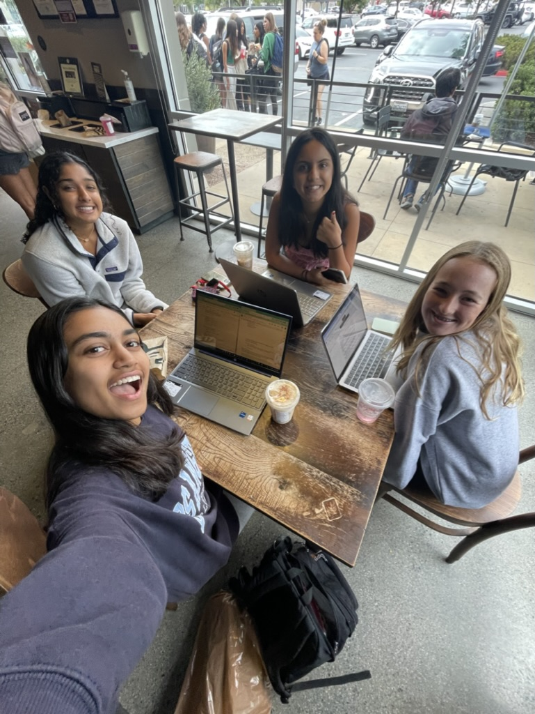

---
layout: default
title: Student Blog
---

## SNAT Team homepage
Welcome to our homepage ;)

## Who are we?

SNAT Scrum Master: Sreeja
- Hi im sreeja. I am a junior and the scrum master of the team.

SNAT backend: Tanvi
- Hi!! I'm Tanvi and I am in 10th grade at Del Norte High School. I like to dance, run, learn, and hang out with my friends. This year I am taking AP Computer Science Principles, AP Calculus, AP Chemistry, Honors Humanities, and Honors Principles of Engineering.

SNAT backend: Nupur
- {write ya bio}

SNAT frontend: Abby
- Hi, I'm Abby and I am in 10th grade at Del Norte High School. I like to read, listen to music, and sleep. This year I am taking AP Computer Science Principles and AP Chemistry. 

## Our project
We aim to create a "study buddy" for our passion project this year. As students at Del Norte, we have a lot to juggle and sometimes it can be overwhelming. With the help of the study buddy, it will allow us to input our schedules and get daily reminders, create flashcards to study with, and have study sessions with an AI.

## Our plan deadlines

| The date to be finished by | Task to be completed |
|------|-------|
|10/8| Create shared repositiories, deploy backend on AWS and front end |
|10/10 | Create the homepage and do a small about-SNAT and add our goal, with study buddy-Frontend assignment. Add in pictures of the crew, create a backgroup on a person struggling to study, and make the background move and loop|
|10/16 |Create the backend code for the inputting of schedules and the code so that it will send notifications and reminders |
| 10/25| Create code for making flashcards, organize it based on subject, and input guideline basics for each subject. Ex. for calc, add flashcards of the basic derivatives of trig functions. For che,: add in solubility rules. We can also consider adding in AI.|
|11/1 |Do a final run-through of the study buddy to make sure everything is running smootly and nothing is glitching. If possible, add a video on the homepage about us. We can add an ad that shows how to use the study buddy and create a user-friendly guide.  |
